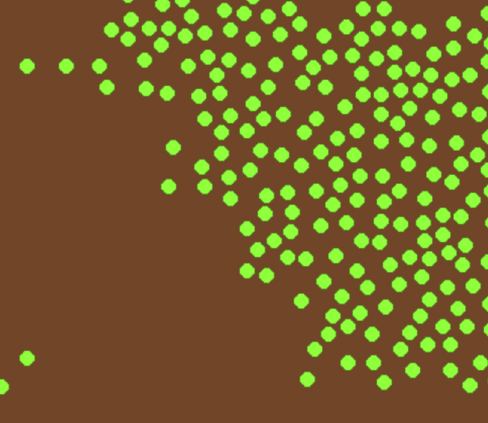
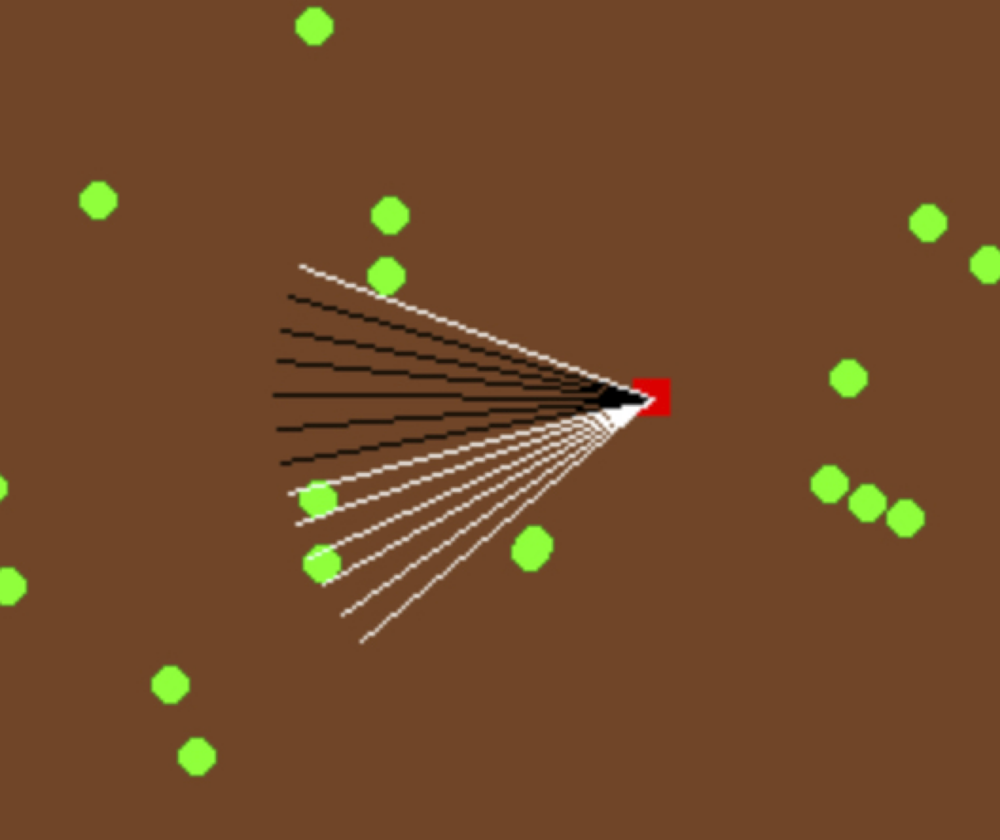
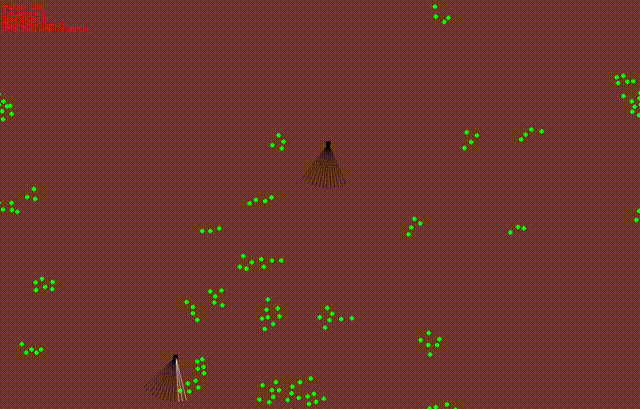

# Evolution Simulation

This project simulates evolution within a basic, two-entity ecosystem.

  

## Plants
Plants serve as sustenance for the creatures in this environment. They are randomly scattered throughout the environment at the outset. Plants reproduce after a set period, provided they are not consumed. This can lead to clusters of plants in certain regions.

  

## Creatures
Creatures have the capacity to move and feed. Each creature possesses a limited energy reserve, and when this reserve is completely exhausted, the creature dies. Consuming plants replenishes a creature's energy. Successful creatures (those that consume a lot of plants) use their surplus energy to reproduce. Offspring are essentially clones of their parent, but with a chance of random mutation. These mutations can modify the weights and biases of a creature's neural network or even add/remove a hidden layer. This mechanism allows the propagation of the fittest creatures while maintaining the potential for evolutionary improvement in their descendants.

  

## Neural Networks
Each creature is equipped with a "field of vision" illustrated by lines extending from its front. These lines "activate" when intersecting with a plant, signaling the creature's awareness of food. These activations serve as input to the creature's neural network. Initially, the network includes one hidden layer. However, its architecture can change via three mutation types:
1. Weights may randomly mutate by incrementing or decrementing by a small quantity.
2. Nodes may be randomly deactivated or activated.
3. Entire layers can be appended or removed from the network.

The simplest model is an input layer linked directly to an output layer, but mutation can introduce an arbitrary number of hidden layers. The neural network's output determines the creature's orientation and velocity.

## Evolution
Creatures start with entirely random weights, without any external incentives to consume food or exhibit specific behavior. However, creatures that do eat, and therefore live longer and reproduce more, naturally outcompete those that ignore food. This selective process gradually yields a population of "intelligent" creatures that seek food without any explicit instruction to do so. After several evolutionary generations, creatures begin to show attraction to food, actively pursuing it when detected:

  

On a larger scale, this evolutionary process can generate interesting emergent behaviors. For instance, the gif below shows creatures learning to encircle plant clusters, promptly consuming new plants as they sprout:

  

## Future Work
We'd love to experiment with some artificial natural selection approaches, like keeping the top five creatures in each generation and spawning the next generation using their weights.

## Installation
Create a virtual environment and install the necessary libraries in requirements.txt. Run `game.py` to start the simulation.
